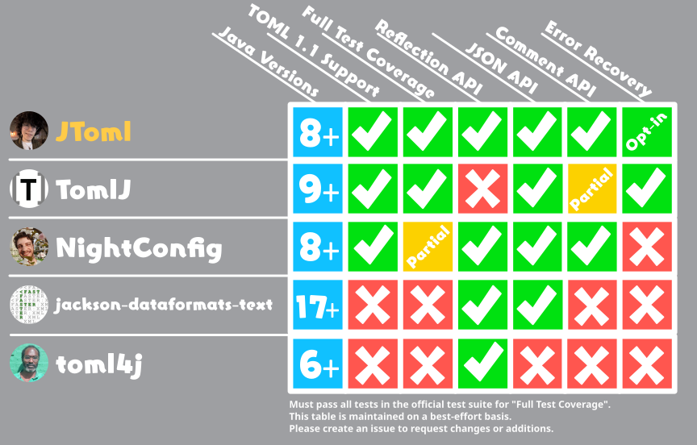

# 


A modular [TOML](https://toml.io/en/v1.1.0) library for Java 8 and above. JToml aims to
be the ultimate solution for all things TOML, fully recreating its type system with a
*robust yet permissive API inspired by Gson*. **To get started, check out [the wiki](https://github.com/WasabiThumb/jtoml/wiki).** For a more technical overview, reference the [javadocs](https://javadoc.io/doc/io.github.wasabithumb/jtoml-api).

## Comparison Table


## Star History

<a href="https://www.star-history.com/?repos=WasabiThumb%2Fjtoml&type=date&legend=top-left">
 <picture>
   <source media="(prefers-color-scheme: dark)" srcset="https://api.star-history.com/chart?repos=WasabiThumb/jtoml&type=date&theme=dark&legend=top-left&sealed_token=M1-fGhdvGyE5d1zIkw5juaCQTltb_vHPfgR1EmBZoRIaK0E3ErewJpOeoKL338jaj1DWfyzU_5bRSx4HVNU9ZAcxqe6TePayGpSviBzRYnH8ZEmtNDdj7A" />
   <source media="(prefers-color-scheme: light)" srcset="https://api.star-history.com/chart?repos=WasabiThumb/jtoml&type=date&legend=top-left&sealed_token=M1-fGhdvGyE5d1zIkw5juaCQTltb_vHPfgR1EmBZoRIaK0E3ErewJpOeoKL338jaj1DWfyzU_5bRSx4HVNU9ZAcxqe6TePayGpSviBzRYnH8ZEmtNDdj7A" />
   
 </picture>
</a>

## Pledge
Code and documentation written by core team members will never and have
never employed  the use of large language models (LLMs) either local or
remote to any extent. PRs or issues suspected of containing AI-generated text,
code or graphics may be closed by project maintainers with no additional 
stated reason.

## License
```text
Copyright 2026 Xavier Pedraza

Licensed under the Apache License, Version 2.0 (the "License");
you may not use this file except in compliance with the License.
You may obtain a copy of the License at

    http://www.apache.org/licenses/LICENSE-2.0

Unless required by applicable law or agreed to in writing, software
distributed under the License is distributed on an "AS IS" BASIS,
WITHOUT WARRANTIES OR CONDITIONS OF ANY KIND, either express or implied.
See the License for the specific language governing permissions and
limitations under the License.
```
