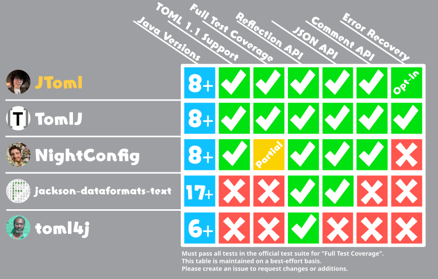

# 


JToml is a modular [TOML](https://toml.io/en/v1.1.0) library for Java 8 and above.
**For a detailed look at all of JToml's features, check out [the wiki](https://github.com/WasabiThumb/jtoml/wiki).**

## Quick Start
### Using JToml
<table>
<tr>
<th>Language</th>
<th>Example Code</th>
</tr>
<tr>
<td>Java</td>
<td>

```java
JToml toml = JToml.jToml(); // default instance
TomlTable table = toml.read(Paths.get("src.toml"));
table.put("w.'x.y'.z", 42);
toml.write(Paths.get("dest.toml"), table);
```

</td>
</tr>
<tr>
<td>Kotlin (JVM)</td>
<td>

```kotlin
val table: TomlTable = KToml.read(Path("src.toml"))
table["w.'x.y'.z"] = 42
KToml.write(Path("dest.toml"), table)
```

</td>
</tr>
</table>

### Getting JToml
Replace `VERSION` with the latest version available
[from Maven Central](https://repo1.maven.org/maven2/io/github/wasabithumb/jtoml/).

<table>
<tr>
<th>Build Script</th>
<th>Syntax</th>
</tr>
<tr>
<td>Gradle (Groovy DSL)<br><i>build.gradle</i></td>
<td>

```groovy
dependencies {
    // jtoml or jtoml-kotlin and any number of optional modules
    implementation 'io.github.wasabithumb:jtoml:VERSION'

    // ...or jtoml-all for everything + JPMS support
    implementation 'io.github.wasabithumb:jtoml-all:VERSION'
}
```

</td>
</tr>
<tr>
<td>Gradle (Kotlin DSL)<br><i>build.gradle.kts</i></td>
<td>

```kotlin
dependencies {
    // jtoml or jtoml-kotlin and any number of optional modules
    implementation("io.github.wasabithumb:jtoml:VERSION")

    // ...or jtoml-all for everything + JPMS support
    implementation("io.github.wasabithumb:jtoml-all:VERSION")
}
```

</td>
</tr>
<tr>
<td>Maven<br><i>pom.xml</i></td>
<td>

```xml
<dependencies>
    <!-- jtoml or jtoml-kotlin and any number of optional modules -->
    <dependency>
        <groupId>io.github.wasabithumb</groupId>
        <artifactId>jtoml</artifactId>
        <version>VERSION</version>
        <scope>compile</scope>
    </dependency>

    <!-- ...or jtoml-all for everything + JPMS support -->
    <dependency>
        <groupId>io.github.wasabithumb</groupId>
        <artifactId>jtoml-all</artifactId>
        <version>VERSION</version>
        <scope>compile</scope>
    </dependency>
</dependencies>
```

</td>
</tr>
</table>

> [!TIP]
> If you are using Gradle's `java-library` plugin,
> you may want to use the `api` configuration instead of `implementation`.
> Read [this](https://docs.gradle.org/current/userguide/java_library_plugin.html#sec:java_library_separation)
> to see if that is the case for your project.

## Why JToml?
- JToml is feature-complete, actively maintained, and covered by the
  official test suite.
- JToml is highly configurable, featuring [dozens of option keys](https://javadoc.io/doc/io.github.wasabithumb/jtoml-api/latest/io/github/wasabithumb/jtoml/option/JTomlOption.html)
  and an options system designed to grow gracefully.
- JToml faithfully implements the TOML type system, allowing you to inspect
  the concrete type of TOML values and automatically coerce primitives.
- JToml *does not flatten the document* while also allowing access to tables
  as if they were a flat map. You can create sub-table views and access
  nested elements from top-level tables.
- JToml *does not use strings* as its canonical key type. When a string key
  is used, it is immediately parsed into a ``TomlKey`` object. Working with
  ``TomlKey`` objects is more optimal and allows unambiguous joining and slicing.
- JToml is configuration-oriented, ready to be used directly or as a backend
  for [Configurate](https://github.com/WasabiThumb/jtoml/wiki/Configurate-Integration),
  [DazzleConf](https://github.com/A248/DazzleConf) and others.
- JToml is unnecessarily optimized, with some individual optimizations
  like [RecSup](https://github.com/WasabiThumb/recsup) necessitating their own projects.
- JToml loves you very much!

### Comparison Table


## Star History

<a href="https://www.star-history.com/?repos=WasabiThumb%2Fjtoml&type=date&legend=top-left">
 <picture>
   <source media="(prefers-color-scheme: dark)" srcset="https://api.star-history.com/chart?repos=WasabiThumb/jtoml&type=date&theme=dark&legend=top-left&sealed_token=M1-fGhdvGyE5d1zIkw5juaCQTltb_vHPfgR1EmBZoRIaK0E3ErewJpOeoKL338jaj1DWfyzU_5bRSx4HVNU9ZAcxqe6TePayGpSviBzRYnH8ZEmtNDdj7A" />
   <source media="(prefers-color-scheme: light)" srcset="https://api.star-history.com/chart?repos=WasabiThumb/jtoml&type=date&legend=top-left&sealed_token=M1-fGhdvGyE5d1zIkw5juaCQTltb_vHPfgR1EmBZoRIaK0E3ErewJpOeoKL338jaj1DWfyzU_5bRSx4HVNU9ZAcxqe6TePayGpSviBzRYnH8ZEmtNDdj7A" />
   
 </picture>
</a>

## Pledge
Code and documentation written by core team members will never and have
never employed  the use of large language models (LLMs) either local or
remote to any extent. PRs or issues suspected of containing AI-generated text,
code or graphics may be closed by project maintainers with no additional
stated reason.

## License
```text
Copyright 2026 Xavier Pedraza

Licensed under the Apache License, Version 2.0 (the "License");
you may not use this file except in compliance with the License.
You may obtain a copy of the License at

    http://www.apache.org/licenses/LICENSE-2.0

Unless required by applicable law or agreed to in writing, software
distributed under the License is distributed on an "AS IS" BASIS,
WITHOUT WARRANTIES OR CONDITIONS OF ANY KIND, either express or implied.
See the License for the specific language governing permissions and
limitations under the License.
```
